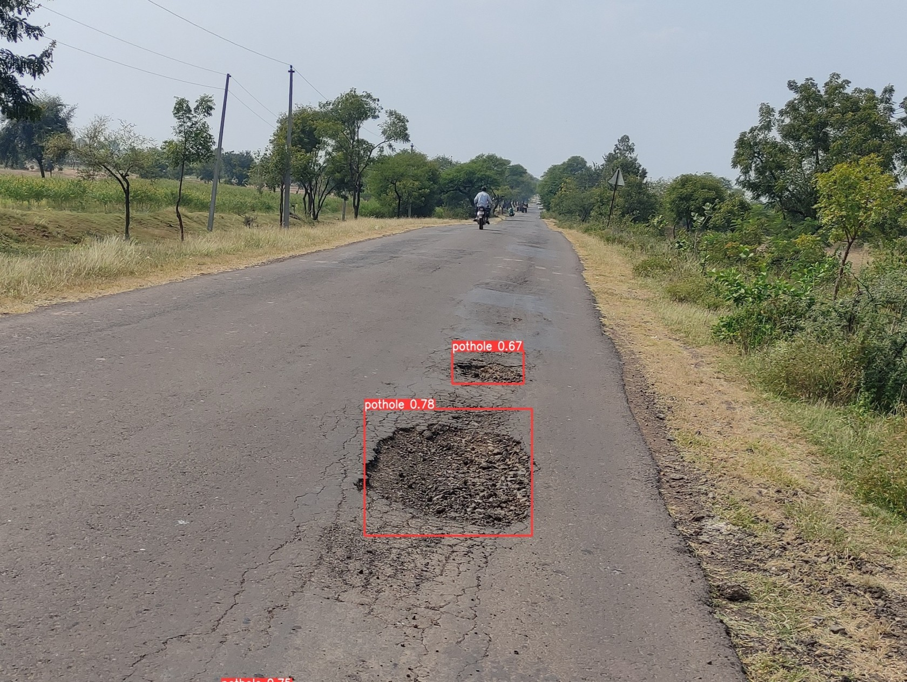
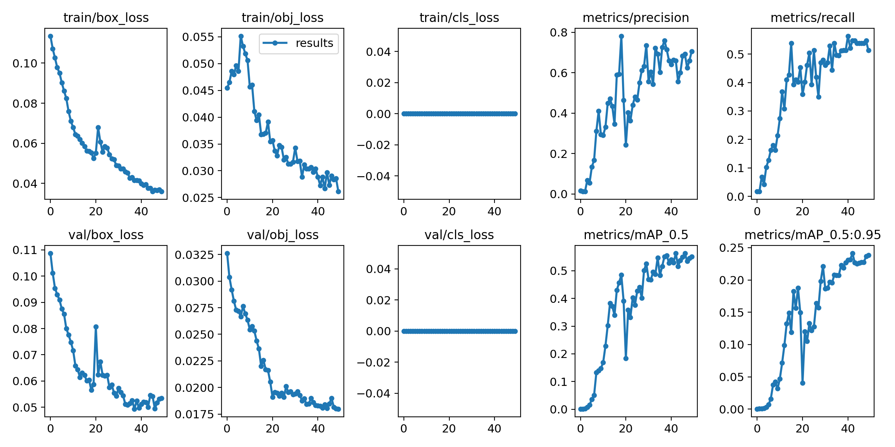

<h1>Real Time Pothole Detection</h1>

This is the project of real time object detection model, using pretrained weights of volov5 algorithm, that performs <a href="https://github.com/abhip07/real-time-pothole-detection">real time Pothole Detection</a>.

 
   
 #### Click on YouTube icon below to see the real time video inference or Click <a href="https://youtu.be/b0Lm3yeNxPM">Here</a>.
 
   

   
   
   
   
   
   
   
    

   
 

<!--

-->

## 
Dataset Used

In this Project I have used custom labelled dataset with some images from google to make the learning process more complex..

## 
Training Dataset Sample

<table border="0">
<tr>
    <td>
    
    </td>
    <td>
    
    </td>
</tr>
</table>

## 
Training Results

   

## 
Yolo vs Efficientdet performance

   

  
YOLOv5 Nano models 

  

### Pretrained Checkpoints for YOLOv5 transfer learning

[assets]: https://github.com/ultralytics/yolov5/releases
[TTA]: https://github.com/ultralytics/yolov5/issues/303

|Model |size (pixels) |mAPval 0.5:0.95 |mAPval 0.5 |Speed CPU b1 (ms) |Speed V100 b1 (ms) |Speed V100 b32 (ms) |params (M) |FLOPs @640 (B)
|---                    |---  |---    |---    |---    |---    |---    |---    |---
|[YOLOv5n][assets]      |640  |28.4   |46.0   |**45** |**6.3**|**0.6**|**1.9**|**4.5**
|[YOLOv5s][assets]      |640  |37.2   |56.0   |98     |6.4    |0.9    |7.2    |16.5
|[YOLOv5m][assets]      |640  |45.2   |63.9   |224    |8.2    |1.7    |21.2   |49.0
|[YOLOv5l][assets]      |640  |48.8   |67.2   |430    |10.1   |2.7    |46.5   |109.1
|[YOLOv5x][assets]      |640  |50.7   |68.9   |766    |12.1   |4.8    |86.7   |205.7
|                       |     |       |       |       |       |       |       |
|[YOLOv5n6][assets]     |1280 |34.0   |50.7   |153    |8.1    |2.1    |3.2    |4.6
|[YOLOv5s6][assets]     |1280 |44.5   |63.0   |385    |8.2    |3.6    |16.8   |12.6
|[YOLOv5m6][assets]     |1280 |51.0   |69.0   |887    |11.1   |6.8    |35.7   |50.0
|[YOLOv5l6][assets]     |1280 |53.6   |71.6   |1784   |15.8   |10.5   |76.8   |111.4
|[YOLOv5x6][assets] + [TTA][TTA]|1280 1536 |54.7 **55.4** |**72.4** 72.3 |3136 - |26.2 - |19.4 - |140.7 - |209.8 -

## In this project I have used YOLOv5l for transfer learning.

## 
Suggest Improvements

If you have suggestions, you can contact me through gmail or Linkedin! This project is in its early stage and I belive it will get improved over the time in future iterations. Thank you!
   
## 
Thank You :)

 
